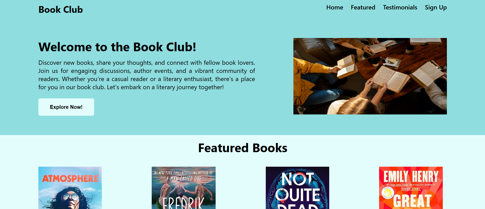
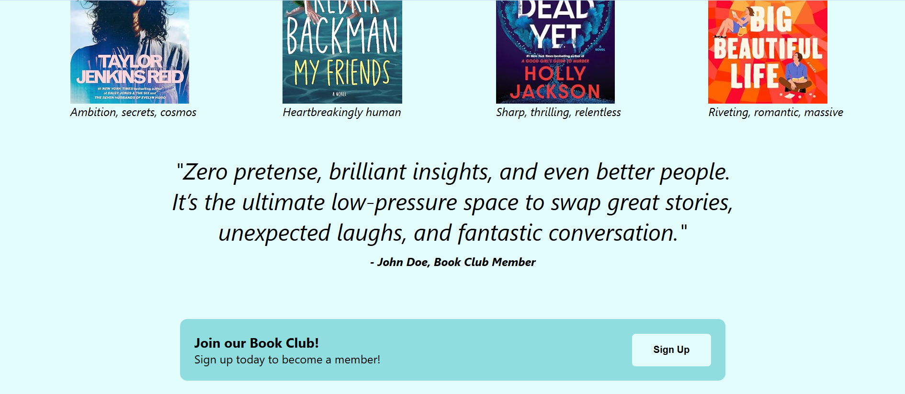

# Book Club Landing Page

A simple landing page for a book club, built with plain HTML and CSS.

## Overview

This project presents a clean book club homepage with a hero section, featured books, testimonials, and a sign-up call to action. It is a static site with no JavaScript or build tooling required.

## Live Project

[View the live project](https://stef1259.github.io/landingPage/)

## Built With

- HTML
- CSS

## Screenshots

Top half of the completed site:

Bottom half of the completed site:

## Attribution

Fable icon by [Icons8](https://icons8.com), used under the source link: [Fable](https://icons8.com/icon/ve327kcqH52j/fable)

## How to view locally

Open [index.html](index.html) in your web browser.

## Project Structure

- [index.html](index.html)
- [styles.css](styles.css)
- [assets](assets)

## Notes

- Created for demonstration and learning purposes.
- No dependencies or build steps are required.
